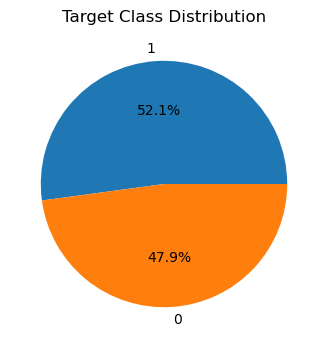
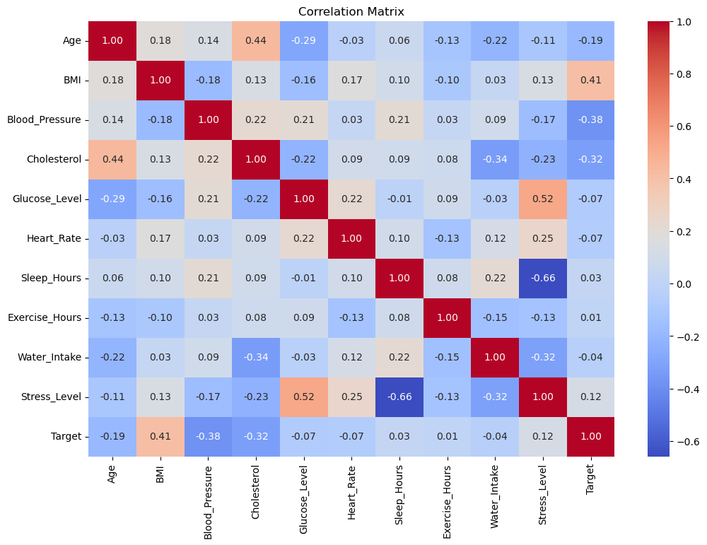
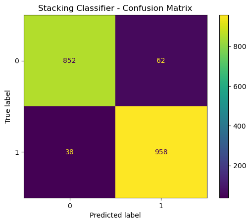
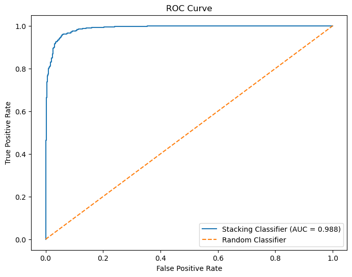

# HealthRisk Predictor

A machine-learning web application that provides a model-assisted health-risk assessment from clinical, lifestyle, and health-profile indicators.

## Live Application

[Open HealthRisk Predictor](https://mvcl6xc9seppdn78uebg4q.streamlit.app/)

## GitHub Repository

[MehediNoorNeo/Health-Risk-Predictor](https://github.com/MehediNoorNeo/Health-Risk-Predictor)

---

## Project Overview

HealthRisk Predictor is an end-to-end supervised machine-learning project. It classifies a health record into two target classes:

| Target | Meaning |
|---|---|
| **0** | No Risk / Healthy |
| **1** | Risk / Unhealthy |

For a submitted health profile, the application returns the predicted class and the model's estimated probability for **Class 1 (risk)**.

> **Important:** This is a machine-learning screening/demo application, not a medical diagnostic system. Its outputs should not be used alone for diagnosis, treatment, or emergency decisions.

---

## Key Features

- Interactive Streamlit health-risk assessment dashboard
- Clinical, lifestyle, and health-profile input sections
- Binary categorical inputs represented as **0/1**
- Diet type and blood group converted to one-hot features expected by the trained model
- Stacking ensemble using Logistic Regression, Random Forest, and XGBoost
- Estimated probability for the risk class
- Dataset insights with summary metrics, class balance, and numeric relationships with the target
- Saved preprocessing and trained-model artifacts for inference

---

## Machine Learning Workflow

```text
Raw Dataset
    ↓
Exploratory Data Analysis
    ↓
Data Validation & Preprocessing
    ↓
Train / Test Split
    ↓
Feature Transformation
    ↓
Stacking Classifier
    ↓
Model Evaluation
    ↓
Model Serialization
    ↓
Streamlit Application
```

### Train/Test Split

The stacking notebook uses:

- **80%** training data
- **20%** test data
- `random_state=42`
- stratified splitting by target

### Preprocessing

The saved preprocessing pipeline uses a `ColumnTransformer`.

**Numeric features**

- SimpleImputer with median strategy
- StandardScaler

**Categorical features**

- SimpleImputer with most-frequent strategy
- OneHotEncoder

The fitted preprocessor is stored in:

```text
models/preprocessor.pkl
```

---

## Model Architecture

The project uses a `StackingClassifier` with three base estimators:

1. Logistic Regression
2. Random Forest Classifier
3. XGBoost Classifier

A Logistic Regression model is used as the final estimator.

```text
        ┌──────────────────────┐
        │ Logistic Regression  │
        └──────────┬───────────┘
                   │
        ┌──────────▼───────────┐
        │   Random Forest      │
        └──────────┬───────────┘
                   │
        ┌──────────▼───────────┐
        │       XGBoost        │
        └──────────┬───────────┘
                   │
            ┌──────▼──────┐
            │ Logistic    │
            │ Regression  │
            │ Meta-model  │
            └──────┬──────┘
                   │
            Final Prediction
```

The trained stacking pipeline is stored in:

```text
models/stacking_pipeline.pkl
```

---

## Input Features

### Clinical Indicators

- Age
- BMI
- Blood Pressure
- Cholesterol
- Glucose Level
- Heart Rate

### Lifestyle Indicators

- Sleep Hours
- Exercise Hours
- Water Intake
- Stress Level
- Smoking
- Alcohol

### Health Profile

- Diet
- Mental Health
- Physical Activity
- Medical History
- Allergies
- Diet Type
- Blood Group

### Encoded Features

Diet type is converted into:

- `Diet_Type__Vegan`
- `Diet_Type__Vegetarian`

Blood group is converted into:

- `Blood_Group_AB`
- `Blood_Group_B`
- `Blood_Group_O`

The binary categorical inputs used in the Streamlit form are passed as **0 or 1**.

---

## Prediction Output

The application displays:

### Prediction Status

- **Class 0 — No Risk / Healthy**
- **Class 1 — Risk / Unhealthy**

### Estimated Risk Probability

The dashboard calculates the probability of **Class 1** using `predict_proba()`.

For presentation, the application labels the returned probability as:

| Probability | Application Label |
|---:|---|
| < 30% | Low estimated risk |
| 30% to < 60% | Moderate estimated risk |
| ≥ 60% | Higher estimated risk |

These bands are UI labels implemented by the application, not clinical risk thresholds.

---

## Model Performance

Evaluation was performed on the held-out test set from `notebokes/03_stacking.ipynb`.

| Metric | Result |
|---|---:|
| Accuracy | **94.76%** |
| ROC-AUC | **98.78%** |
| Class 0 Precision | **0.96** |
| Class 0 Recall | **0.93** |
| Class 0 F1-score | **0.94** |
| Class 1 Precision | **0.94** |
| Class 1 Recall | **0.96** |
| Class 1 F1-score | **0.95** |

**Test-set size:** 1,910 records.

These values describe performance on the project's particular held-out dataset and are not evidence of clinical effectiveness.

---

## Exploratory Data Analysis

### Target Distribution

The target-distribution figure shows the balance between the two prediction classes in the dataset.



### Feature Correlation

The correlation matrix provides an overview of relationships among the dataset's numeric features.



---

## Model Evaluation

### Confusion Matrix

The confusion matrix summarizes the model's classification results on the held-out test set.



### ROC Curve

The ROC curve visualizes the classifier's ability to distinguish between the two target classes across classification thresholds.



---

## Project Structure

```text
Health-Risk-Predictor/
│
├── data/
│   ├── .ipynb_checkpoints/
│   └── novagen_dataset.csv
│
├── figures/
│   ├── target_distribution.png
│   ├── correlation_matrix.png
│   ├── confusion_matrix.png
│   └── roc_curve.png
│
├── models/
│   ├── preprocessor.pkl
│   └── stacking_pipeline.pkl
│
├── notebokes/
│   ├── 01_EDA.ipynb
│   ├── 02_preprocessing.ipynb
│   └── 03_stacking.ipynb
│
├── src/
│   └── app.py
│
└── requirements.txt
```

> The repository currently uses the folder name `notebokes`; the README keeps that spelling to match the actual repository.

---

## Technologies Used

- **Python**
- **Pandas** — data loading and manipulation
- **NumPy** — numerical processing
- **Matplotlib** — visualization
- **Scikit-learn** — preprocessing, stacking, and evaluation
- **XGBoost** — gradient-boosting estimator
- **Joblib** — model serialization
- **Streamlit** — web application

### Dependencies

The current `requirements.txt` contains:

```text
streamlit>=1.40
pandas>=2.0
scikit-learn>=1.3
xgboost>=2.0
joblib>=1.3
```

---

## Installation

### 1. Clone the repository

```bash
git clone https://github.com/MehediNoorNeo/Health-Risk-Predictor.git
cd Health-Risk-Predictor
```

### 2. Create a virtual environment

**Windows**

```bash
python -m venv .venv
.venv\Scripts\activate
```

**macOS / Linux**

```bash
python3 -m venv .venv
source .venv/bin/activate
```

### 3. Install dependencies

```bash
pip install -r requirements.txt
```

---

## Run the Application Locally

From the project root:

```bash
streamlit run src/app.py
```

Then open the local URL displayed by Streamlit, usually:

```text
http://localhost:8501
```

---

## Application Workflow

1. Open the **Risk assessment** tab.
2. Enter clinical indicators.
3. Enter lifestyle indicators.
4. Select binary health-profile values using 0/1.
5. Select diet type and blood group.
6. Click **Generate risk assessment**.
7. The saved stacking pipeline generates a class prediction.
8. The dashboard displays the prediction status and estimated Class-1 probability.

The **Dataset insights** tab provides training-record statistics, class balance, and selected numeric relationships with the target.

The **About** tab describes the model, input encoding, target classes, and responsible-use guidance.

---

## Notebook Overview

### `01_EDA.ipynb`

Exploratory data analysis and visualization of the dataset.

### `02_preprocessing.ipynb`

Preprocessing workflow and creation of the fitted preprocessing artifact.

### `03_stacking.ipynb`

Model development and evaluation, including:

- Train/test split
- Stacking model construction
- Prediction
- Classification report
- ROC-AUC
- Confusion matrix
- ROC curve
- Saving the trained pipeline

---

## Data and Model Artifacts

The Streamlit application relies on:

```text
data/novagen_dataset.csv
models/preprocessor.pkl
models/stacking_pipeline.pkl
```

The application resolves these paths relative to the project directory, so the repository structure should be preserved when running locally.

---

## Responsible Use

HealthRisk Predictor is intended as a **machine-learning project and screening/demo application**.

It should not be treated as:

- A medical diagnosis system
- A substitute for a qualified healthcare professional
- A treatment recommendation system
- An emergency decision-making tool

Predictions depend on the data, preprocessing, trained model, and information entered by the user.

---

## Future Improvements

- External validation on independent datasets
- Hyperparameter optimization
- Probability calibration
- Explainable-AI features such as SHAP
- Model monitoring and drift detection
- More robust input validation
- Fairness and subgroup analysis
- Additional real-world, clinically validated datasets
- Automated tests and CI/CD
- Containerized deployment

---

## Author

**Mehedi Noor**

GitHub: [@MehediNoorNeo](https://github.com/MehediNoorNeo)

---

## License

No license file is currently included in the repository. Add an appropriate license before distributing the project as open-source software.
